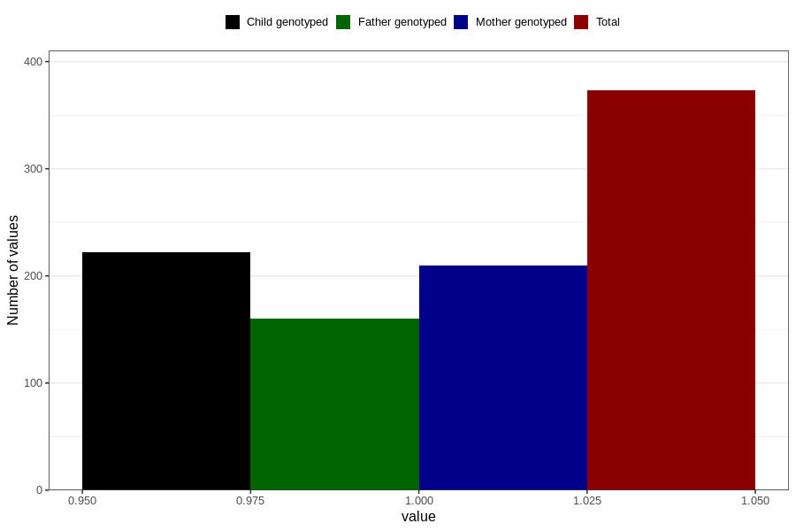

# heart_defect_yes_3y
Variable mapping to questionnaire: q6, question GG62.
- Number of values:

| Value | Total | Child genotyped | Mother genotyped | Father genotyped |
| ----- | ----- | --------------- | ---------------- | ---------------- |
| Missing | 113250 | 75209 | 71559 | 50058 |
| Non-missing | 373 | 222 | 210 | 160 |
| 1 | 373 | 222 | 210 | 160 |

