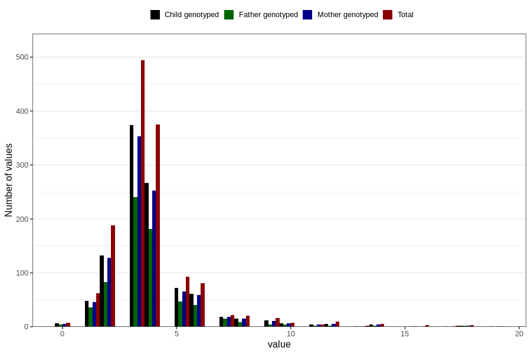

# hip_treated_cushion_duration_18m
Variable mapping to questionnaire: q5, question EE214.
- Number of values:

| Value | Total | Child genotyped | Mother genotyped | Father genotyped |
| ----- | ----- | --------------- | ---------------- | ---------------- |
| Missing | 112224 | 74401 | 70791 | 49546 |
| Non-missing | 1399 | 1030 | 978 | 672 |
| 25th percentile | 3 | 3 | 3 | 3 |
| 50th percentile | 3 | 3 | 3 | 3 |
| 75th percentile | 4 | 4 | 4 | 4 |

