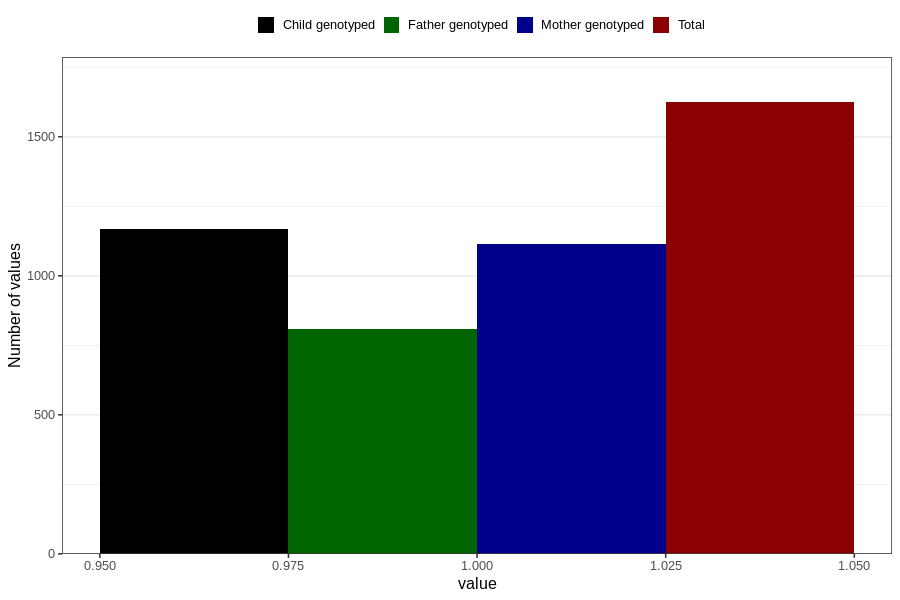

# hives_previously_18m
Variable mapping to questionnaire: q5, question EE833.
- Number of values:

| Value | Total | Child genotyped | Mother genotyped | Father genotyped |
| ----- | ----- | --------------- | ---------------- | ---------------- |
| Missing | 111999 | 74263 | 70654 | 49411 |
| Non-missing | 1624 | 1168 | 1115 | 807 |
| 1 | 1624 | 1168 | 1115 | 807 |

