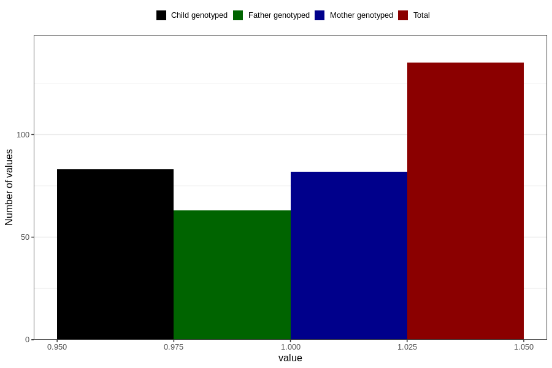

# impaired_vision_previous_3y
Variable mapping to questionnaire: q6, question GG35.
- Number of values:

| Value | Total | Child genotyped | Mother genotyped | Father genotyped |
| ----- | ----- | --------------- | ---------------- | ---------------- |
| Missing | 113488 | 75348 | 71687 | 50155 |
| Non-missing | 135 | 83 | 82 | 63 |
| 1 | 135 | 83 | 82 | 63 |

