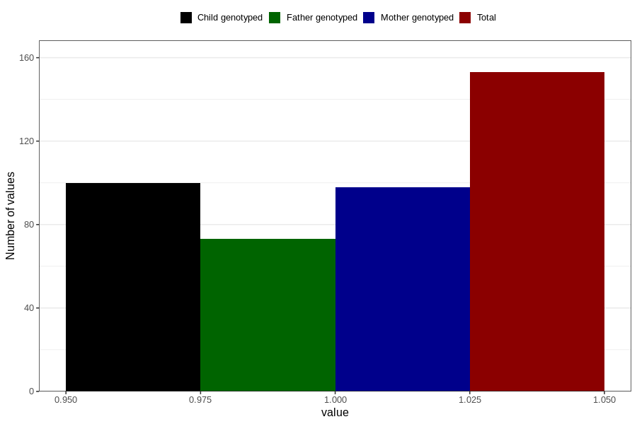

# impaired_vision_previously_18m
Variable mapping to questionnaire: q5, question EE797.
- Number of values:

| Value | Total | Child genotyped | Mother genotyped | Father genotyped |
| ----- | ----- | --------------- | ---------------- | ---------------- |
| Missing | 113470 | 75331 | 71671 | 50145 |
| Non-missing | 153 | 100 | 98 | 73 |
| 1 | 153 | 100 | 98 | 73 |

