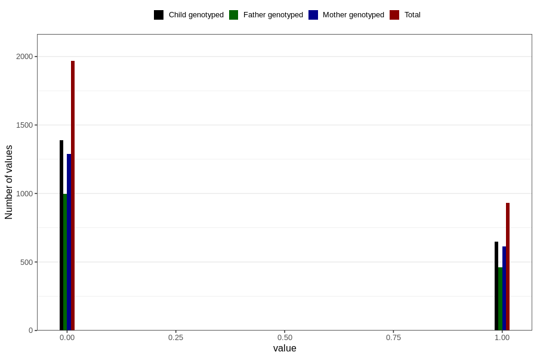

# other_gastrointestinal_problems_2_previous_3y
Variable mapping to questionnaire: q6, question GG576.
- Number of values:

| Value | Total | Child genotyped | Mother genotyped | Father genotyped |
| ----- | ----- | --------------- | ---------------- | ---------------- |
| Missing | 110725 | 73392 | 69867 | 48762 |
| Non-missing | 2898 | 2039 | 1902 | 1456 |
| 0 | 1967 | 1390 | 1288 | 997 |
| 1 | 931 | 649 | 614 | 459 |

