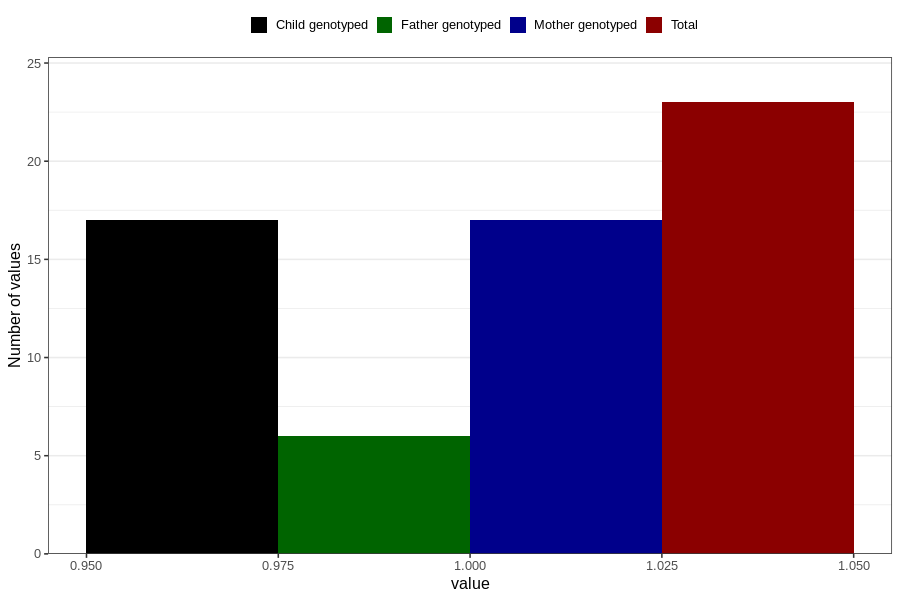

# other_gastrointestinal_problems_previous_3y
Variable mapping to questionnaire: q6, question GG91.
- Number of values:

| Value | Total | Child genotyped | Mother genotyped | Father genotyped |
| ----- | ----- | --------------- | ---------------- | ---------------- |
| Missing | 113600 | 75414 | 71752 | 50212 |
| Non-missing | 23 | 17 | 17 | 6 |
| 1 | 23 | 17 | 17 | 6 |

