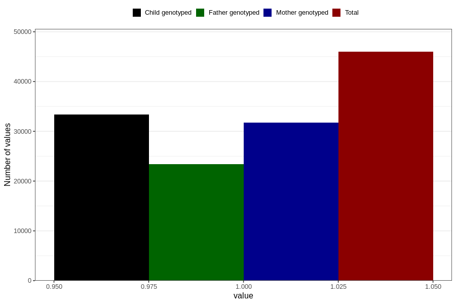

# other_malformations_no_18m
Variable mapping to questionnaire: q5, question EE851.
- Number of values:

| Value | Total | Child genotyped | Mother genotyped | Father genotyped |
| ----- | ----- | --------------- | ---------------- | ---------------- |
| Missing | 67655 | 42018 | 40001 | 26780 |
| Non-missing | 45968 | 33413 | 31768 | 23438 |
| 1 | 45968 | 33413 | 31768 | 23438 |

