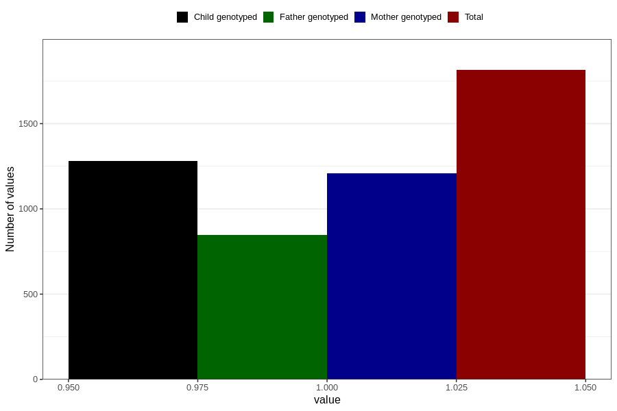

# sleep_problems_previous_3y
Variable mapping to questionnaire: q6, question GG99.
- Number of values:

| Value | Total | Child genotyped | Mother genotyped | Father genotyped |
| ----- | ----- | --------------- | ---------------- | ---------------- |
| Missing | 111809 | 74150 | 70559 | 49371 |
| Non-missing | 1814 | 1281 | 1210 | 847 |
| 1 | 1814 | 1281 | 1210 | 847 |

