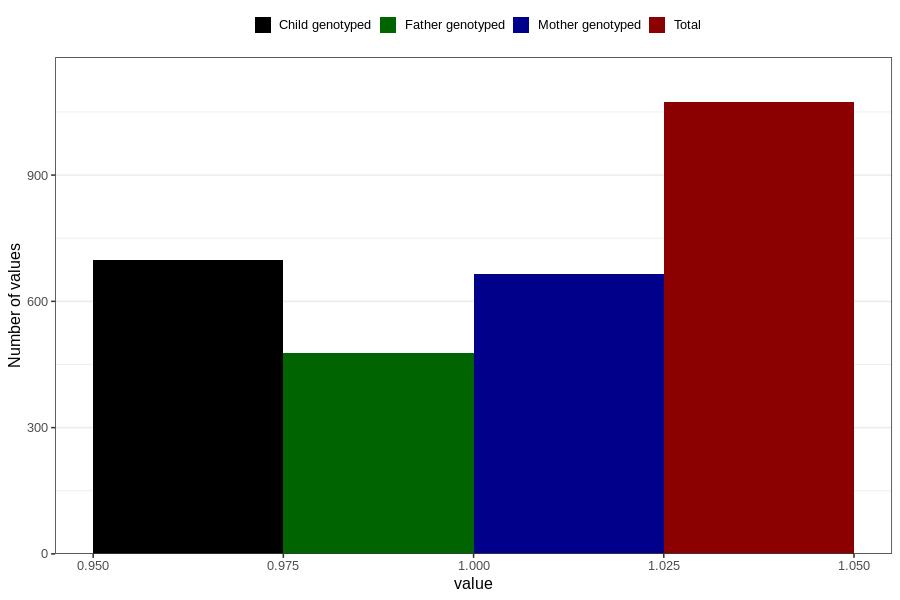

# sleep_problems_yes_3y
Variable mapping to questionnaire: q6, question GG98.
- Number of values:

| Value | Total | Child genotyped | Mother genotyped | Father genotyped |
| ----- | ----- | --------------- | ---------------- | ---------------- |
| Missing | 112550 | 74732 | 71105 | 49741 |
| Non-missing | 1073 | 699 | 664 | 477 |
| 1 | 1073 | 699 | 664 | 477 |

