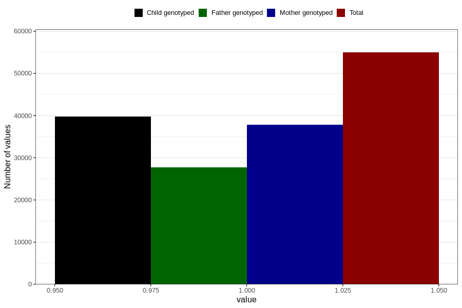

# testicles_not_descended_scrotum_no_3y
Variable mapping to questionnaire: q6, question GG65.
- Number of values:

| Value | Total | Child genotyped | Mother genotyped | Father genotyped |
| ----- | ----- | --------------- | ---------------- | ---------------- |
| Missing | 58677 | 35664 | 33988 | 22446 |
| Non-missing | 54946 | 39767 | 37781 | 27772 |
| 1 | 54946 | 39767 | 37781 | 27772 |

