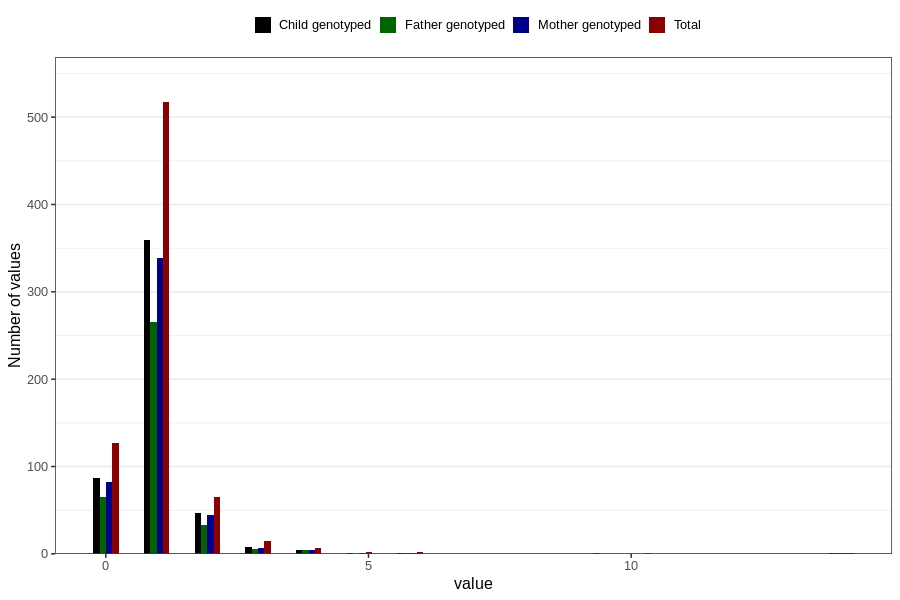

# urinary_tract_infection_freq_6m
Variable mapping to questionnaire: q4, question DD288.
- Number of values:

| Value | Total | Child genotyped | Mother genotyped | Father genotyped |
| ----- | ----- | --------------- | ---------------- | ---------------- |
| Missing | 112885 | 74922 | 71289 | 49842 |
| Non-missing | 738 | 509 | 480 | 376 |
| 0 | 127 | 87 | 82 | 65 |
| 1 | 517 | 359 | 339 | 266 |
| 2 | 65 | 47 | 44 | 33 |
| 3 | 15 | 8 | 7 | 6 |
| 4 | 7 | 5 | 5 | 4 |
| 5 | 2 | 1 | 1 | 0 |
| 6 | 2 | 1 | 1 | 1 |
| 9 | 1 | 0 | 0 | 0 |
| 10 | 1 | 0 | 0 | 0 |
| 14 | 1 | 1 | 1 | 1 |

