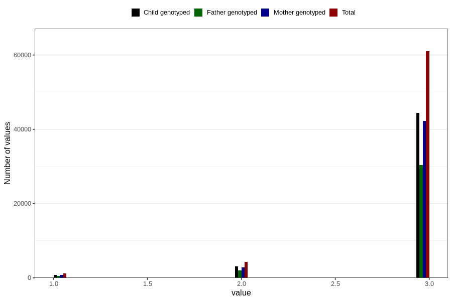

# vaccine_dtp_freq_18m
Variable mapping to questionnaire: q5, question EE151.
- Number of values:

| Value | Total | Child genotyped | Mother genotyped | Father genotyped |
| ----- | ----- | --------------- | ---------------- | ---------------- |
| Missing | 47156 | 27201 | 25861 | 17323 |
| Non-missing | 66467 | 48230 | 45908 | 32895 |
| 1 | 1210 | 841 | 797 | 558 |
| 2 | 4267 | 3025 | 2885 | 2004 |
| 3 | 60990 | 44364 | 42226 | 30333 |

