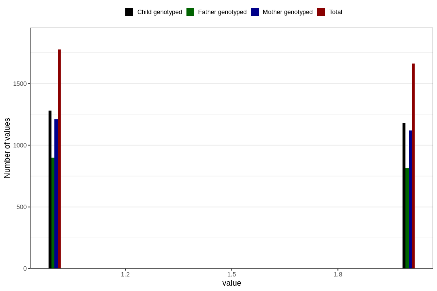

# omega3_capsules_amount_per_time_7y
Variable mapping to questionnaire: q8, question JJ533.
- Number of values:

| Value | Total | Child genotyped | Mother genotyped | Father genotyped |
| ----- | ----- | --------------- | ---------------- | ---------------- |
| Missing | 110056 | 72885 | 69355 | 48447 |
| Non-missing | 3567 | 2546 | 2414 | 1771 |
| 3+ at a time | 126 | 89 | 82 |57 |
| More than 1 check box filled in | 2 | 1 | 1 |1 |
| 1 | 1775 | 1279 | 1211 | 900 |
| 2 | 1664 | 1177 | 1120 | 813 |

