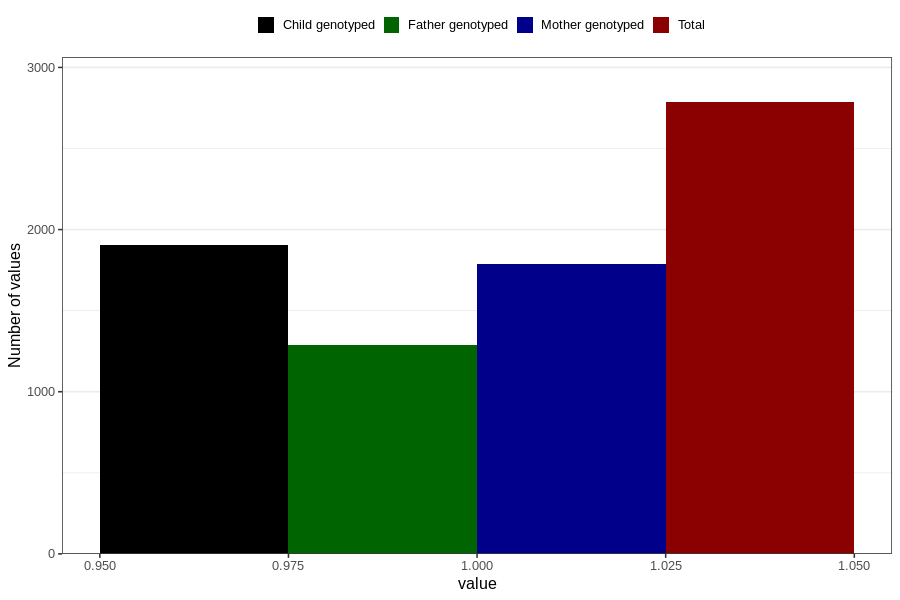

# other_milk_4m
Variable mapping to questionnaire: q4, question DD88.
- Number of values:

| Value | Total | Child genotyped | Mother genotyped | Father genotyped |
| ----- | ----- | --------------- | ---------------- | ---------------- |
| Missing | 110838 | 73525 | 69982 | 48928 |
| Non-missing | 2785 | 1906 | 1787 | 1290 |
| 1 | 2785 | 1906 | 1787 | 1290 |

