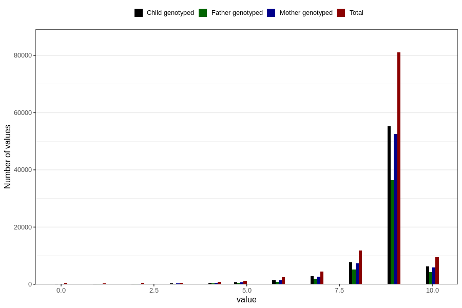

# apgar_1
Variable mapping to questionnaire: mfr, question APGAR1.
- Number of values:

| Value | Total | Child genotyped | Mother genotyped | Father genotyped |
| ----- | ----- | --------------- | ---------------- | ---------------- |
| Missing | 493 | 84 | 80 | 45 |
| Non-missing | 113130 | 75347 | 71689 | 50173 |
| 0 | 505 | 87 | 83 | 56 |
| 1 | 305 | 123 | 114 | 78 |
| 2 | 468 | 220 | 210 | 162 |
| 3 | 579 | 293 | 280 | 215 |
| 4 | 848 | 478 | 460 | 317 |
| 5 | 1313 | 754 | 723 | 518 |
| 6 | 2414 | 1436 | 1351 | 938 |
| 7 | 4402 | 2791 | 2655 | 1928 |
| 8 | 11781 | 7717 | 7341 | 5217 |
| 9 | 81020 | 55164 | 52524 | 36463 |
| 10 | 9495 | 6284 | 5948 | 4281 |

