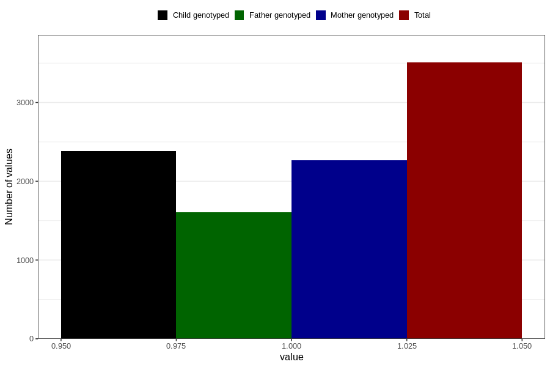

# asthma_during
Variable mapping to questionnaire: q1m, question AA420.
- Number of values:

| Value | Total | Child genotyped | Mother genotyped | Father genotyped |
| ----- | ----- | --------------- | ---------------- | ---------------- |
| Missing | 110116 | 73044 | 69505 | 48611 |
| Non-missing | 3507 | 2387 | 2264 | 1607 |
| 1 | 3507 | 2387 | 2264 | 1607 |

