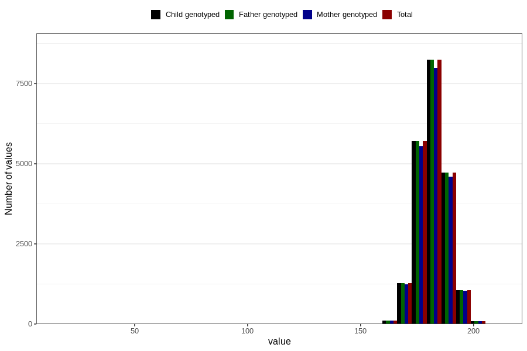

# father_height_far2
- Number of values:

| Value | Total | Child genotyped | Mother genotyped | Father genotyped |
| ----- | ----- | --------------- | ---------------- | ---------------- |
| Missing | 92396 | 54204 | 51166 | 28991 |
| Non-missing | 21227 | 21227 | 20603 | 21227 |
| 25th percentile | 178 | 178 | 178 | 178 |
| 50th percentile | 182 | 182 | 182 | 182 |
| 75th percentile | 186 | 186 | 186 | 186 |

