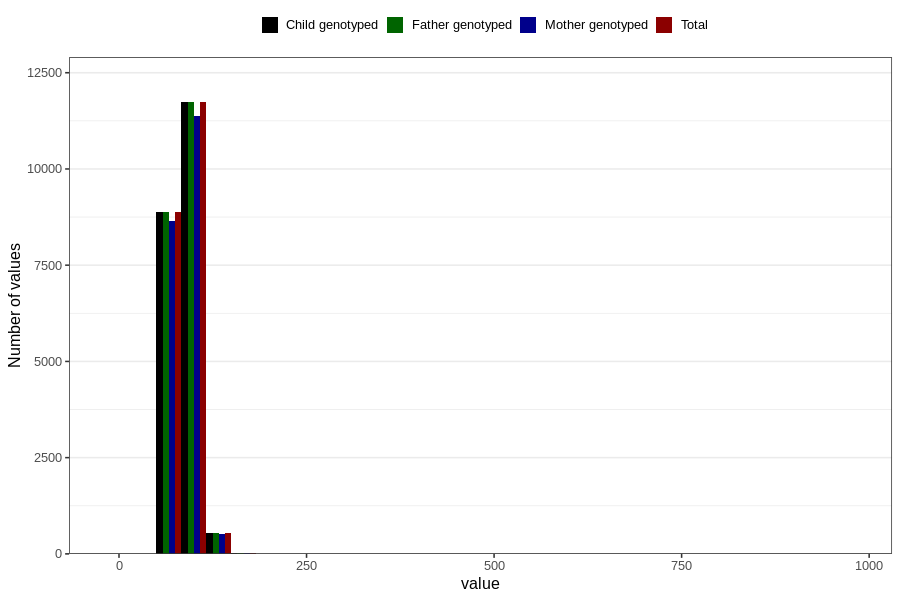

# father_weight_far2
- Number of values:

| Value | Total | Child genotyped | Mother genotyped | Father genotyped |
| ----- | ----- | --------------- | ---------------- | ---------------- |
| Missing | 92450 | 54258 | 51219 | 29045 |
| Non-missing | 21173 | 21173 | 20550 | 21173 |
| 25th percentile | 79 | 79 | 79 | 79 |
| 50th percentile | 85 | 85 | 85 | 85 |
| 75th percentile | 95 | 95 | 95 | 95 |

