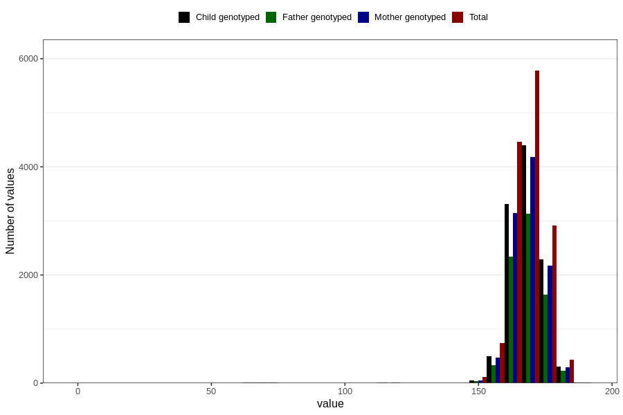

# mother_height_5y
Variable mapping to questionnaire: q7, question LL338.
- Number of values:

| Value | Total | Child genotyped | Mother genotyped | Father genotyped |
| ----- | ----- | --------------- | ---------------- | ---------------- |
| Missing | 99119 | 64539 | 61418 | 42486 |
| Non-missing | 14504 | 10892 | 10351 | 7732 |
| 25th percentile | 164 | 164 | 164 | 164 |
| 50th percentile | 168 | 168 | 168 | 168 |
| 75th percentile | 172 | 172 | 172 | 172 |

