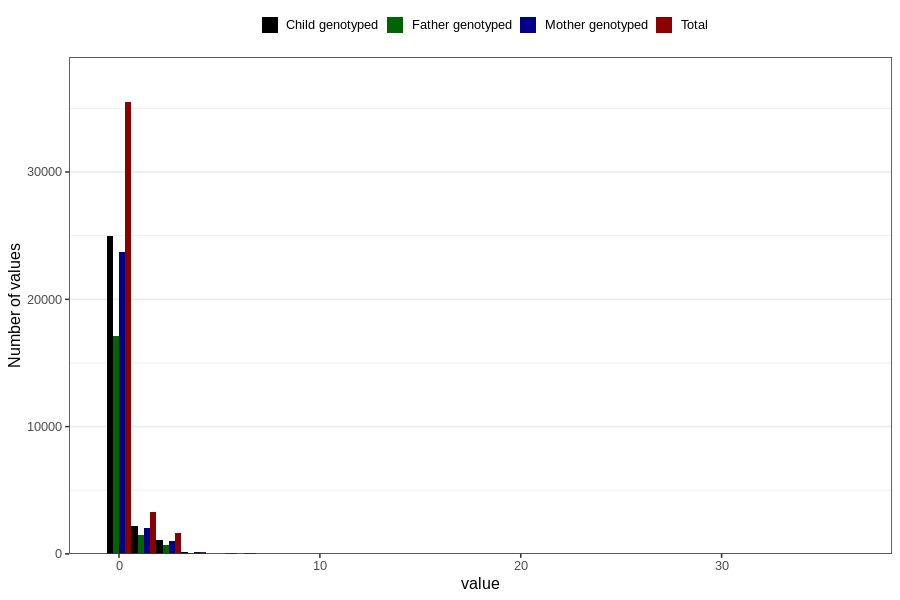

# coffee_during_instant
Variable mapping to questionnaire: q1m, question AA1381.
- Number of values:

| Value | Total | Child genotyped | Mother genotyped | Father genotyped |
| ----- | ----- | --------------- | ---------------- | ---------------- |
| Missing | 72921 | 47013 | 44744 | 30842 |
| Non-missing | 40702 | 28418 | 27025 | 19376 |
| 0 | 35475 | 24969 | 23753 | 17089 |
| 1 | 3312 | 2161 | 2056 | 1454 |
| 2 | 1399 | 938 | 887 | 613 |
| 3 | 218 | 137 | 130 | 85 |
| 4 | 173 | 123 | 117 | 77 |
| 5 | 34 | 23 | 20 | 18 |
| 6 | 62 | 43 | 41 | 28 |
| 7 | 8 | 6 | 4 | 4 |
| 8 | 8 | 8 | 8 | 4 |
| 10 | 10 | 7 | 6 | 3 |
| 14 | 1 | 1 | 1 | 1 |
| 24 | 1 | 1 | 1 | 0 |
| 36 | 1 | 1 | 1 | 0 |

