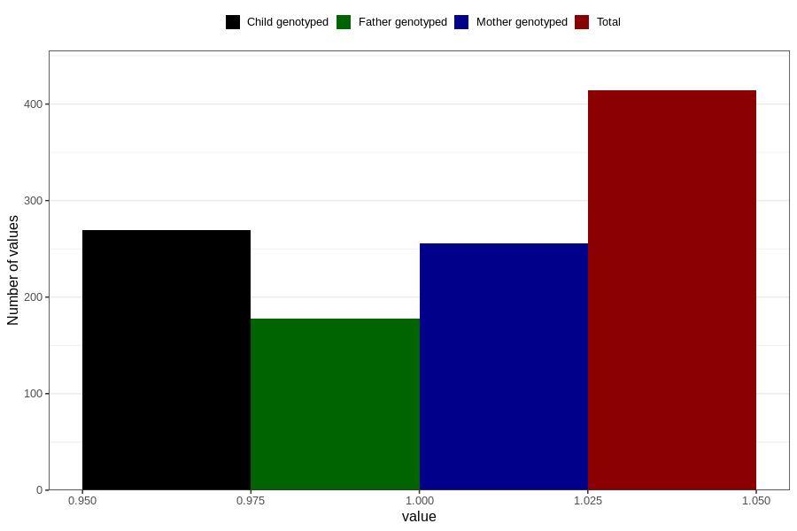

# oedema_before_4w
Variable mapping to questionnaire: q1m, question AA316.
- Number of values:

| Value | Total | Child genotyped | Mother genotyped | Father genotyped |
| ----- | ----- | --------------- | ---------------- | ---------------- |
| Missing | 113209 | 75162 | 71513 | 50040 |
| Non-missing | 414 | 269 | 256 | 178 |
| 1 | 414 | 269 | 256 | 178 |

