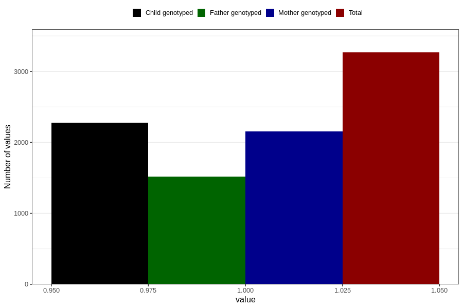

# other_muscle_joint_pain_13w_16w
Variable mapping to questionnaire: q3, question CC364.
- Number of values:

| Value | Total | Child genotyped | Mother genotyped | Father genotyped |
| ----- | ----- | --------------- | ---------------- | ---------------- |
| Missing | 110357 | 73153 | 69612 | 48702 |
| Non-missing | 3266 | 2278 | 2157 | 1516 |
| 1 | 3266 | 2278 | 2157 | 1516 |

