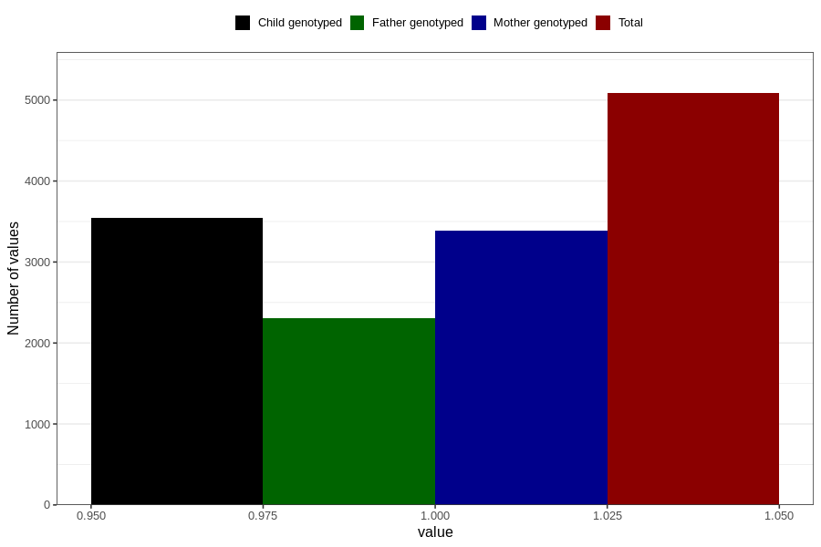

# pregnancy_itch_21w_24w
Variable mapping to questionnaire: q3, question CC426.
- Number of values:

| Value | Total | Child genotyped | Mother genotyped | Father genotyped |
| ----- | ----- | --------------- | ---------------- | ---------------- |
| Missing | 108539 | 71885 | 68387 | 47911 |
| Non-missing | 5084 | 3546 | 3382 | 2307 |
| 1 | 5084 | 3546 | 3382 | 2307 |

