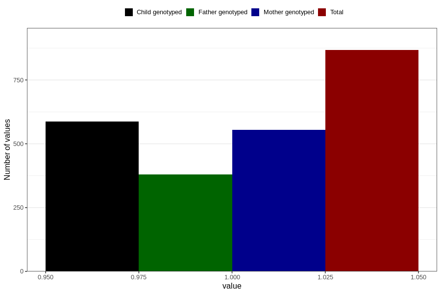

# throat_infection_5w_8w
Variable mapping to questionnaire: q1m, question AA357.
- Number of values:

| Value | Total | Child genotyped | Mother genotyped | Father genotyped |
| ----- | ----- | --------------- | ---------------- | ---------------- |
| Missing | 112756 | 74843 | 71215 | 49838 |
| Non-missing | 867 | 588 | 554 | 380 |
| 1 | 867 | 588 | 554 | 380 |

