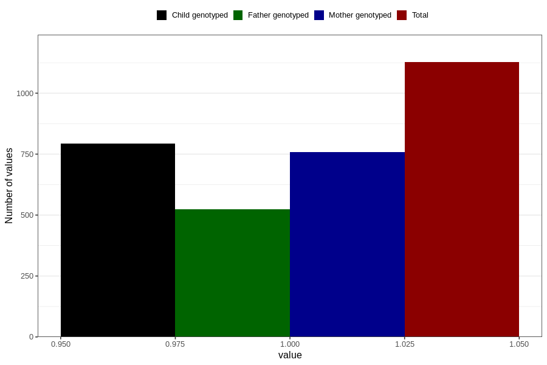

# vaginal_bleeding_know_why_placenta_position
Variable mapping to questionnaire: q3, question CC333.
- Number of values:

| Value | Total | Child genotyped | Mother genotyped | Father genotyped |
| ----- | ----- | --------------- | ---------------- | ---------------- |
| Missing | 112496 | 74638 | 71011 | 49693 |
| Non-missing | 1127 | 793 | 758 | 525 |
| 1 | 1127 | 793 | 758 | 525 |

