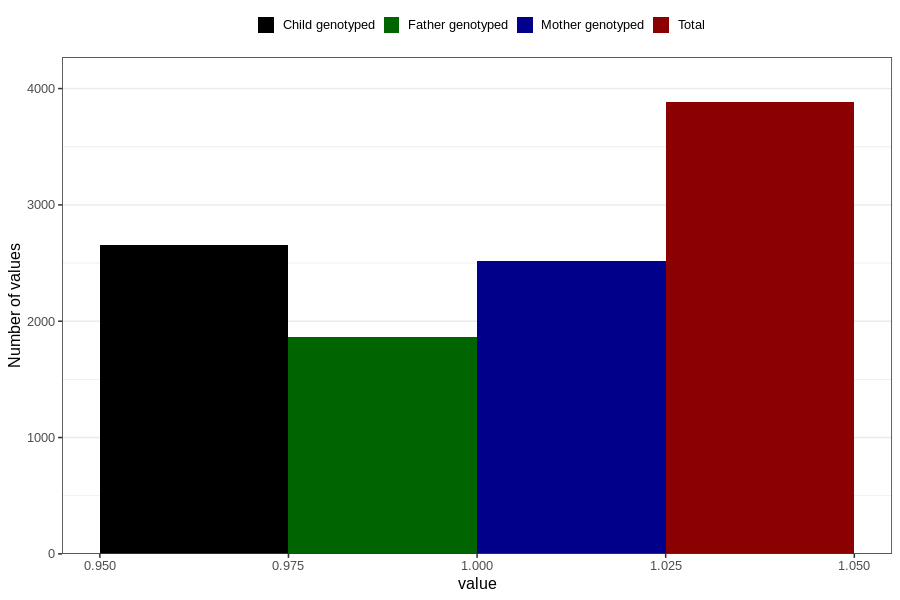

# contraception_used_other
Variable mapping to questionnaire: q1m, question AA39.
- Number of values:

| Value | Total | Child genotyped | Mother genotyped | Father genotyped |
| ----- | ----- | --------------- | ---------------- | ---------------- |
| Missing | 109741 | 72777 | 69252 | 48356 |
| Non-missing | 3882 | 2654 | 2517 | 1862 |
| 1 | 3882 | 2654 | 2517 | 1862 |

