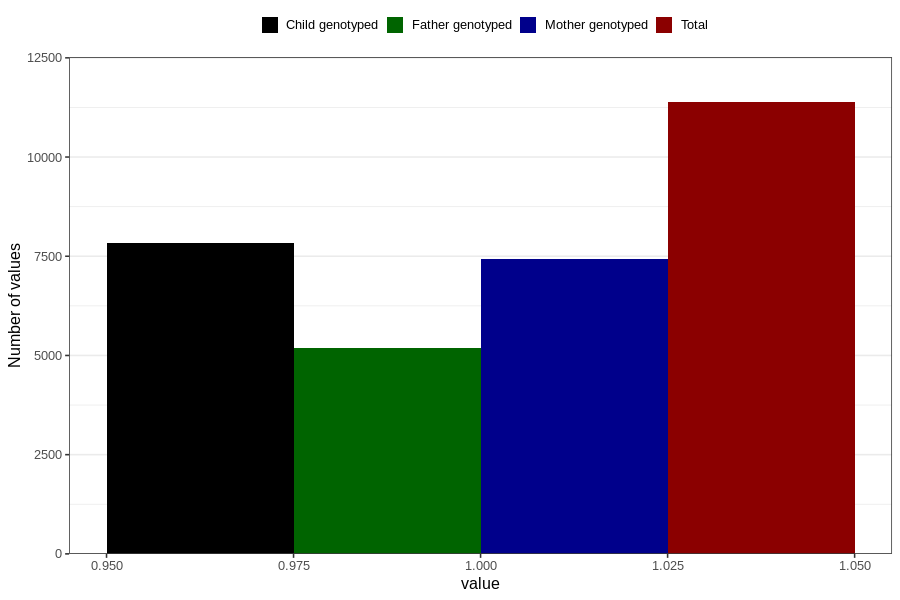

# contraception_used_safe_period
Variable mapping to questionnaire: q1m, question AA36.
- Number of values:

| Value | Total | Child genotyped | Mother genotyped | Father genotyped |
| ----- | ----- | --------------- | ---------------- | ---------------- |
| Missing | 102243 | 67589 | 64328 | 45023 |
| Non-missing | 11380 | 7842 | 7441 | 5195 |
| 1 | 11380 | 7842 | 7441 | 5195 |

