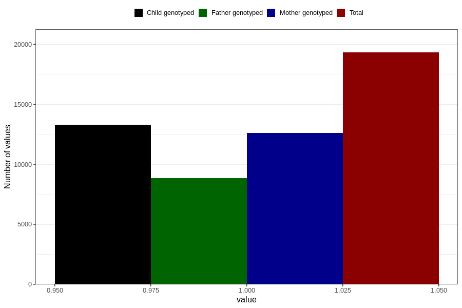

# contraception_used_withdrawal
Variable mapping to questionnaire: q1m, question AA37.
- Number of values:

| Value | Total | Child genotyped | Mother genotyped | Father genotyped |
| ----- | ----- | --------------- | ---------------- | ---------------- |
| Missing | 94310 | 62150 | 59176 | 41390 |
| Non-missing | 19313 | 13281 | 12593 | 8828 |
| 1 | 19313 | 13281 | 12593 | 8828 |

