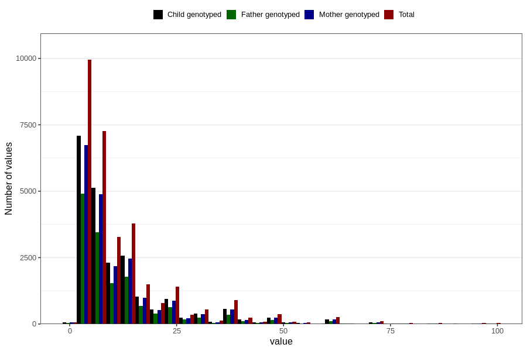

# months_intercourse_without_contraception_2
Variable mapping to questionnaire: q1m, question AA48.
- Number of values:

| Value | Total | Child genotyped | Mother genotyped | Father genotyped |
| ----- | ----- | --------------- | ---------------- | ---------------- |
| Missing | 82229 | 53554 | 50931 | 35383 |
| Non-missing | 31394 | 21877 | 20838 | 14835 |
| 25th percentile | 5 | 5 | 5 | 5 |
| 50th percentile | 7 | 7 | 7 | 7 |
| 75th percentile | 14 | 14 | 14 | 13 |

