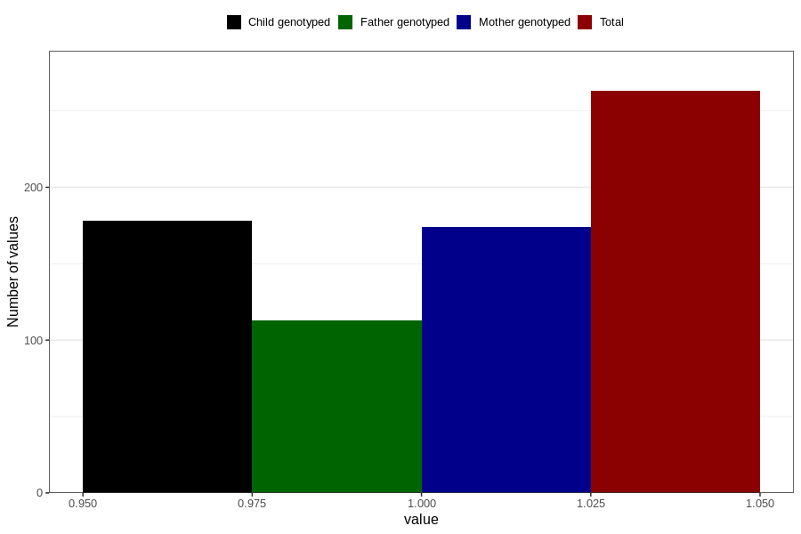

# treated_for_infertility_fallopian_tube_suregery
Variable mapping to questionnaire: q1m, question AA69.
- Number of values:

| Value | Total | Child genotyped | Mother genotyped | Father genotyped |
| ----- | ----- | --------------- | ---------------- | ---------------- |
| Missing | 113360 | 75253 | 71595 | 50105 |
| Non-missing | 263 | 178 | 174 | 113 |
| 1 | 263 | 178 | 174 | 113 |

