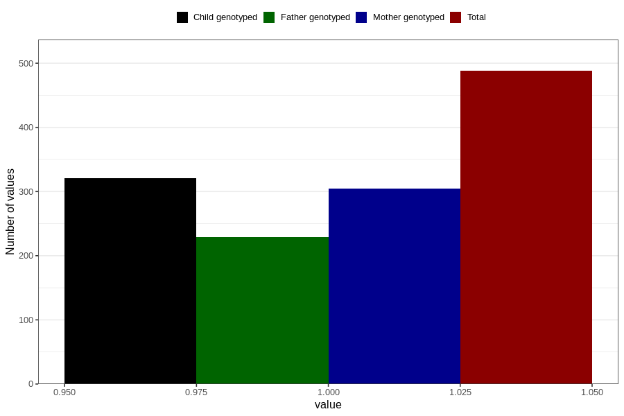

# treated_for_infertility_other_surgery
Variable mapping to questionnaire: q1m, question AA71.
- Number of values:

| Value | Total | Child genotyped | Mother genotyped | Father genotyped |
| ----- | ----- | --------------- | ---------------- | ---------------- |
| Missing | 113135 | 75110 | 71464 | 49989 |
| Non-missing | 488 | 321 | 305 | 229 |
| 1 | 488 | 321 | 305 | 229 |

