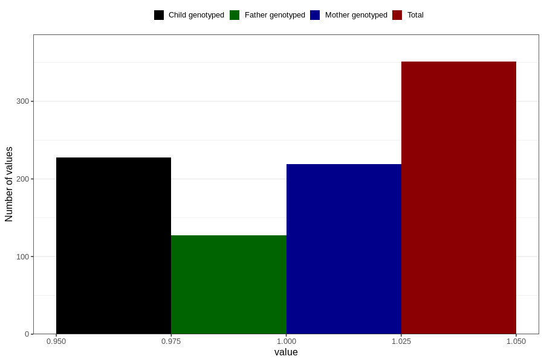

# treated_for_infertility_previous_insemination
Variable mapping to questionnaire: q1m, question AA76.
- Number of values:

| Value | Total | Child genotyped | Mother genotyped | Father genotyped |
| ----- | ----- | --------------- | ---------------- | ---------------- |
| Missing | 113272 | 75203 | 71550 | 50091 |
| Non-missing | 351 | 228 | 219 | 127 |
| 1 | 351 | 228 | 219 | 127 |

