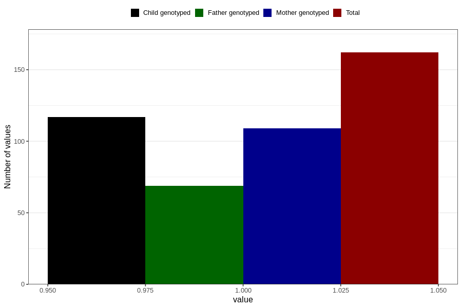

# treated_for_infertility_previous_medication_endometriosis
Variable mapping to questionnaire: q1m, question AA72.
- Number of values:

| Value | Total | Child genotyped | Mother genotyped | Father genotyped |
| ----- | ----- | --------------- | ---------------- | ---------------- |
| Missing | 113461 | 75314 | 71660 | 50149 |
| Non-missing | 162 | 117 | 109 | 69 |
| 1 | 162 | 117 | 109 | 69 |

