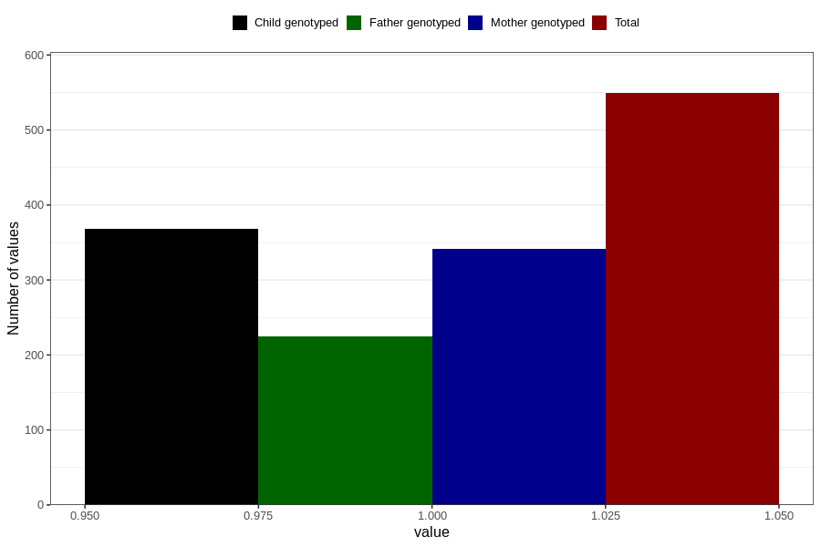

# treated_for_infertility_previous_other
Variable mapping to questionnaire: q1m, question AA80.
- Number of values:

| Value | Total | Child genotyped | Mother genotyped | Father genotyped |
| ----- | ----- | --------------- | ---------------- | ---------------- |
| Missing | 113074 | 75063 | 71428 | 49993 |
| Non-missing | 549 | 368 | 341 | 225 |
| 1 | 549 | 368 | 341 | 225 |

