# Phenotypes
### Number of values

### Length vs weight

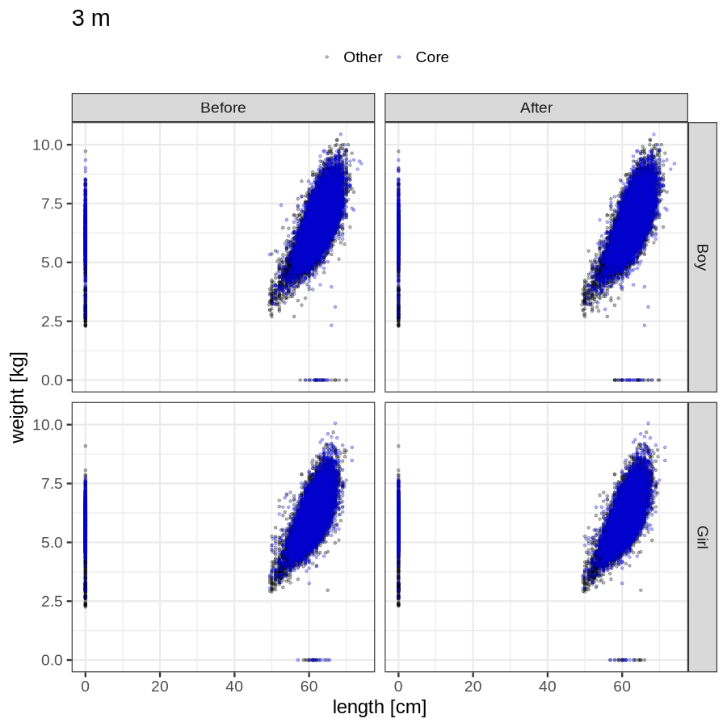
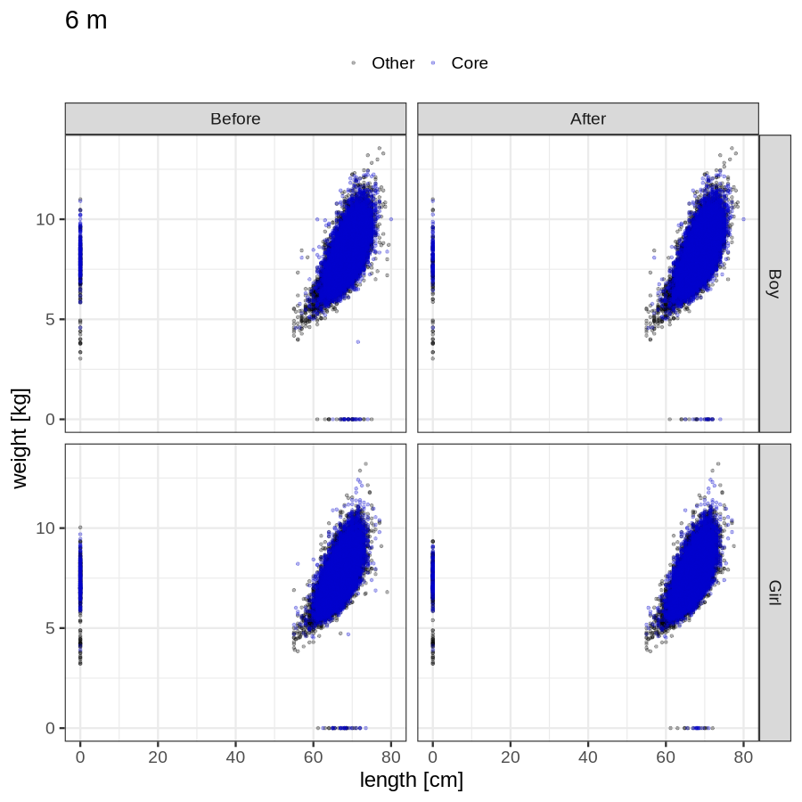

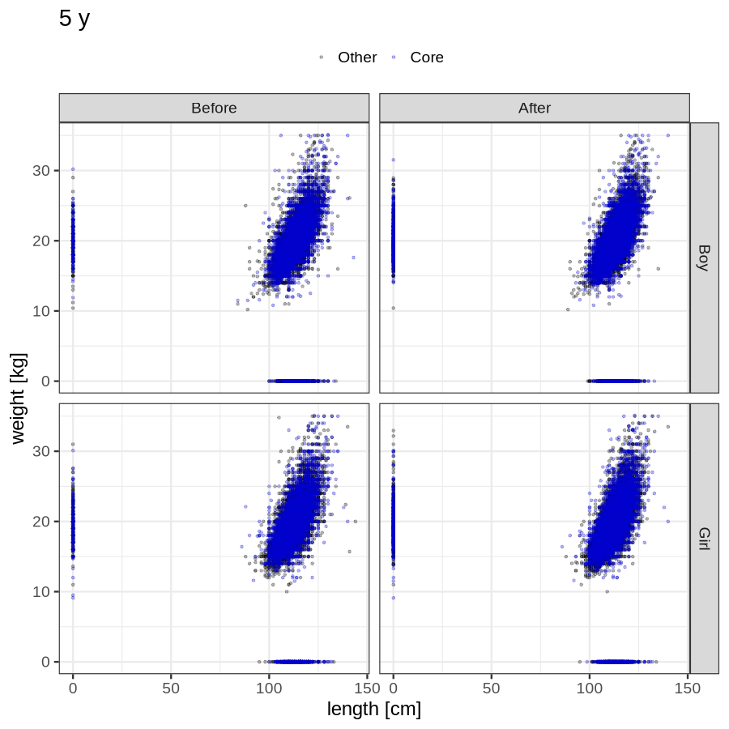

### Imputation
- Children with no data point altered: 68649
- Children with at least one data point altered: 44974
#### Random example: 83179
> imputed@length_16m imputed@length_2y imputed@weight_16m imputed@weight_2y

#### Random example: 67114
> imputed@length_16m imputed@length_2y imputed@weight_16m imputed@weight_2y

#### Random example: 18516
> imputed@length_16m imputed@length_2y imputed@weight_16m imputed@weight_2y

#### Random example: 85111
> imputed@length_16m imputed@length_2y imputed@weight_16m imputed@weight_2y
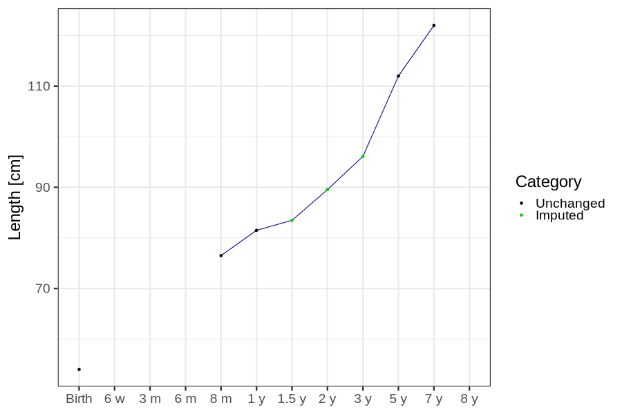

#### Random example: 76574
> imputed@length_16m imputed@length_2y imputed@weight_16m imputed@weight_2y

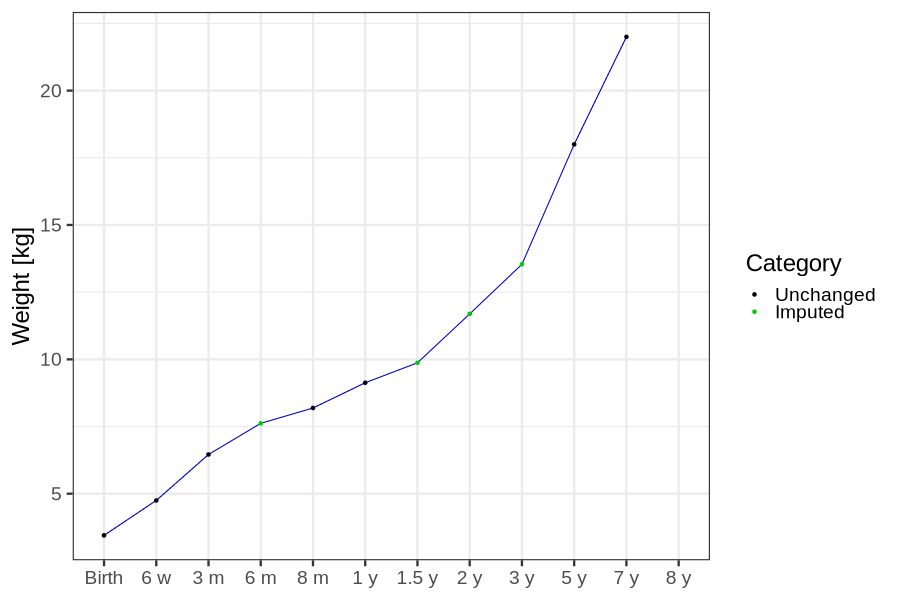
#### Random example: 59864
> imputed@length_16m imputed@length_2y imputed@weight_16m imputed@weight_2y

#### Random example: 46973
> imputed@length_16m imputed@length_2y imputed@weight_16m imputed@weight_2y

#### Random example: 85444
> imputed@length_16m imputed@length_2y imputed@weight_16m imputed@weight_2y

#### Random example: 61114
> imputed@length_16m imputed@length_2y imputed@weight_16m imputed@weight_2y
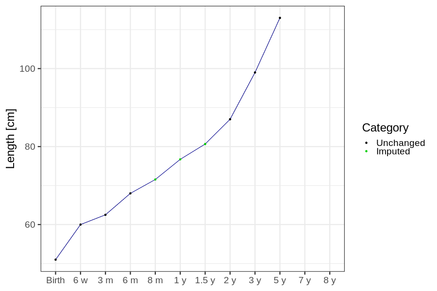

#### Random example: 90899
> imputed@length_16m imputed@length_2y imputed@weight_16m imputed@weight_2y

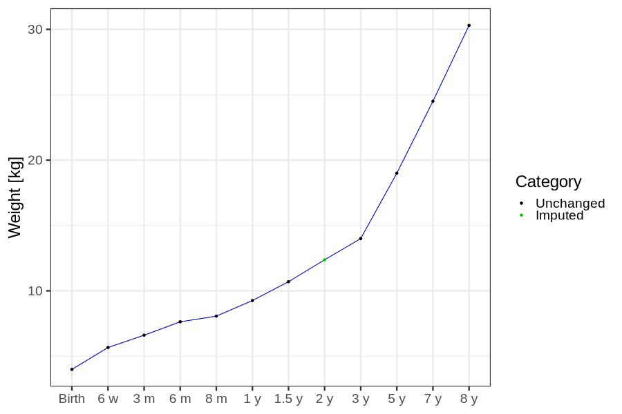
#### Random example: 108021
> imputed@length_16m imputed@length_2y imputed@weight_16m imputed@weight_2y

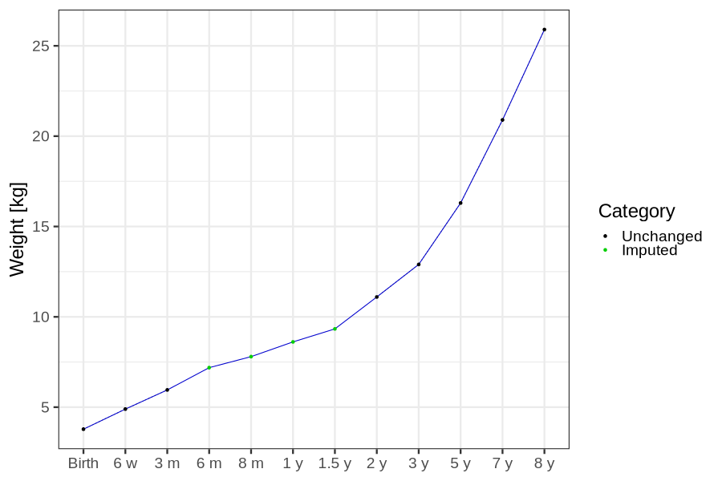
#### Random example: 92380
> imputed@length_16m imputed@length_2y imputed@weight_16m imputed@weight_2y

#### Random example: 108846
> imputed@length_16m imputed@length_2y imputed@weight_16m imputed@weight_2y
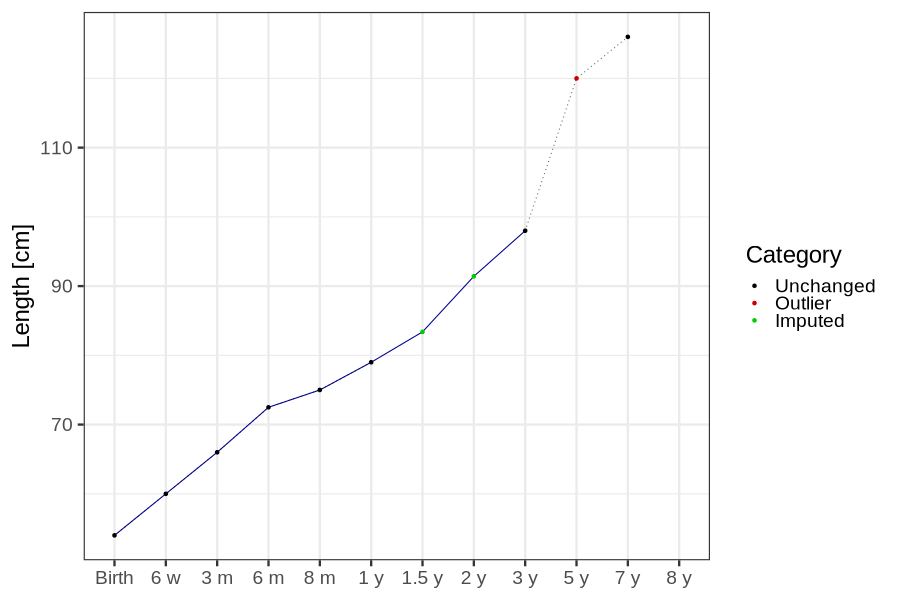

#### Random example: 24645
> imputed@length_16m imputed@length_2y imputed@weight_16m imputed@weight_2y
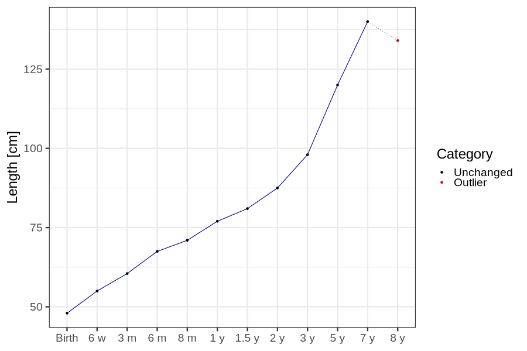

#### Random example: 52854
> imputed@length_16m imputed@length_2y imputed@weight_16m imputed@weight_2y

#### Random example: 57403
> imputed@length_16m imputed@length_2y imputed@weight_16m imputed@weight_2y

#### Random example: 64753
> imputed@length_16m imputed@length_2y imputed@weight_16m imputed@weight_2y

#### Random example: 33641
> imputed@length_16m imputed@length_2y imputed@weight_16m imputed@weight_2y

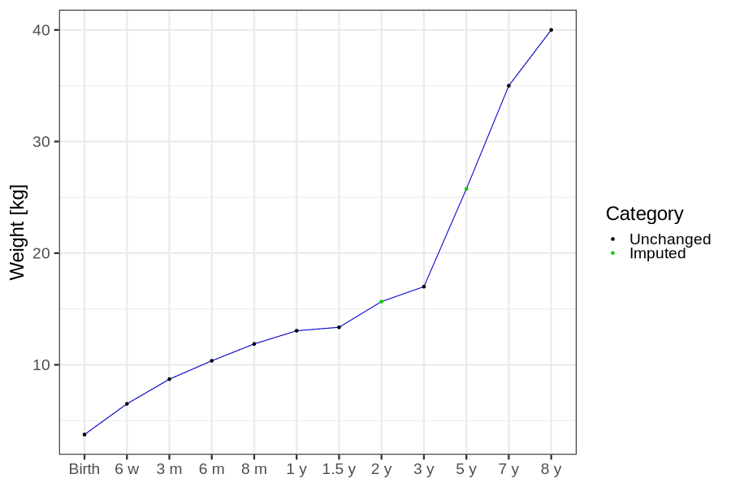
#### Random example: 88083
> imputed@length_16m imputed@length_2y imputed@weight_16m imputed@weight_2y

#### Random example: 102278
> imputed@length_16m imputed@length_2y imputed@weight_16m imputed@weight_2y

#### Most extreme example (1): 26529
> 

#### Most extreme example (2): 17284
> 

#### Most extreme example (3): 41294
> imputed@length_16m imputed@length_2y imputed@weight_16m imputed@weight_2y

#### Most extreme example (4): 4379
> imputed@length_16m imputed@length_2y imputed@weight_16m imputed@weight_2y

#### Most extreme example (5): 14125
> 

#### Most extreme example (6): 52378
> imputed@length_8m imputed@length_1y imputed@length_16m imputed@weight_8m imputed@weight_1y imputed@weight_16m

#### Most extreme example (7): 5992
> outlier@length_2y imputed@length_2y
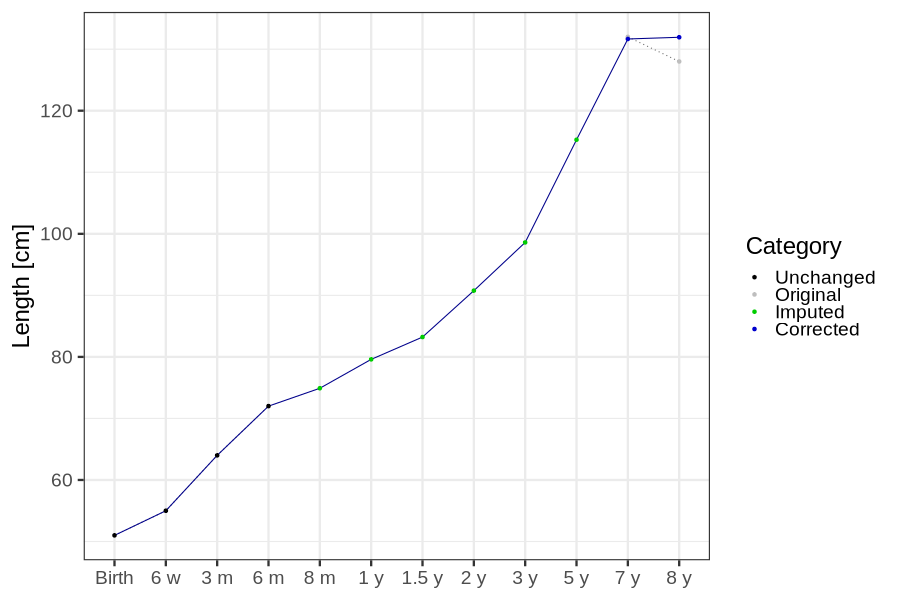

#### Most extreme example (8): 56373
> 

#### Most extreme example (9): 75463
> 

#### Most extreme example (10): 97334
> imputed@length_5y imputed@weight_5y

#### Most extreme example (11): 8111
> 

#### Most extreme example (12): 13120
> imputed@weight_6m imputed@weight_8m imputed@weight_16m

#### Most extreme example (13): 47531
> imputed@length_16m imputed@length_2y imputed@weight_16m imputed@weight_2y

#### Most extreme example (14): 104323
> 

#### Most extreme example (15): 20185
> 

#### Most extreme example (16): 75477
> outlier@weight_1y imputed@weight_1y imputed@weight_2y

#### Most extreme example (17): 40078
> 

#### Most extreme example (18): 43526
> 

#### Most extreme example (19): 34360
> imputed@length_16m imputed@length_2y imputed@weight_16m imputed@weight_2y

#### Most extreme example (20): 78307
> 

