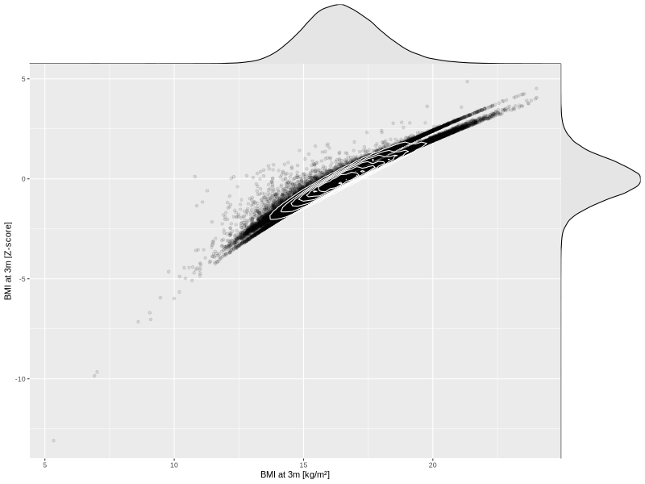

## BMI at 3m

| Name | # Children | # Mothers | # Fathers | # Total |
| ---- | ---------- | --------- | --------- | ------- |
| bmi_3m | 61542 | 58614 | 41470 | 161626 |
| z_bmi_3m | 61542 | 58614 | 41470 | 161626 |

- Formula: `bmi_3m ~ fp(pregnancy_duration_1)`
- Sigma formula: ` ~ pregnancy_duration_1`
- Distribution: `LOGNO`
- Normalization: `centiles.pred` Z-scores

