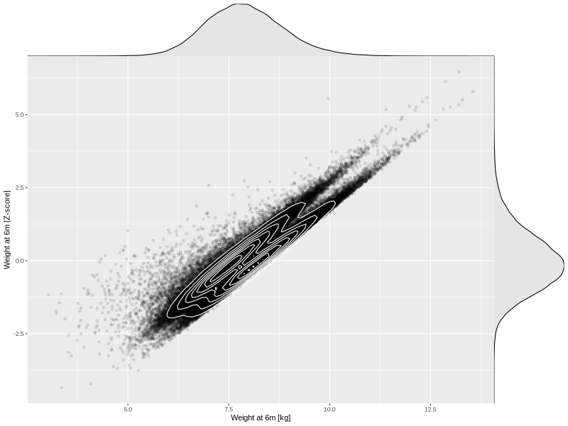

## Weight at 6m

| Name | # Children | # Mothers | # Fathers | # Total |
| ---- | ---------- | --------- | --------- | ------- |
| weight_6m | 62576 | 59590 | 42163 | 164329 |
| z_weight_6m | 62576 | 59590 | 42163 | 164329 |

- Formula: `weight_6m ~ fp(pregnancy_duration_1)`
- Sigma formula: ` ~ pregnancy_duration_1`
- Distribution: `NO`
- Normalization: `centiles.pred` Z-scores

