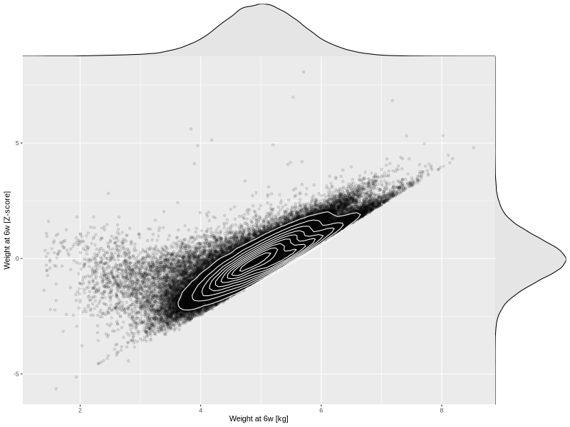

## Weight at 6w

| Name | # Children | # Mothers | # Fathers | # Total |
| ---- | ---------- | --------- | --------- | ------- |
| weight_6w | 55836 | 53035 | 39487 | 148358 |
| z_weight_6w | 55836 | 53035 | 39487 | 148358 |

- Formula: `weight_6w ~ fp(pregnancy_duration_1)`
- Sigma formula: ` ~ pregnancy_duration_1`
- Distribution: `NO`
- Normalization: `centiles.pred` Z-scores

