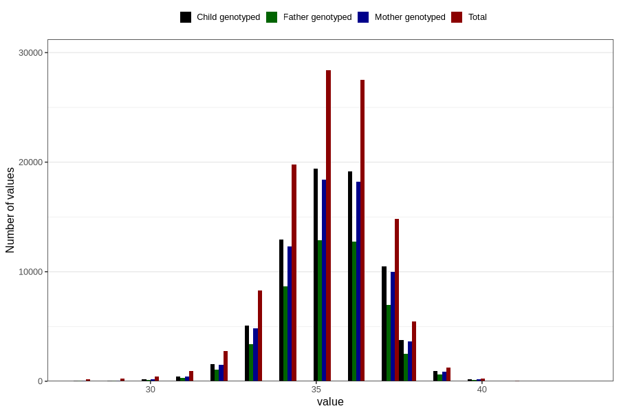

# hc_birth
Variable mapping to questionnaire: mfr, question HODE.
- Number of values:

| Value | Total | Child genotyped | Mother genotyped | Father genotyped |
| ----- | ----- | --------------- | ---------------- | ---------------- |
| Missing | 3249 | 1265 | 1199 | 870 |
| Non-missing | 110374 | 74166 | 70570 | 49348 |
| 28 | 155 | 51 | 49 | 34 |
| 29 | 249 | 84 | 83 | 56 |
| 30 | 430 | 163 | 155 | 106 |
| 31 | 951 | 454 | 430 | 297 |
| 32 | 2778 | 1560 | 1499 | 1029 |
| 33 | 8285 | 5067 | 4826 | 3360 |
| 34 | 19789 | 12911 | 12293 | 8659 |
| 35 | 28376 | 19400 | 18421 | 12866 |
| 36 | 27518 | 19138 | 18194 | 12761 |
| 37 | 14807 | 10455 | 9956 | 6957 |
| 38 | 5460 | 3776 | 3616 | 2512 |
| 39 | 1278 | 911 | 862 | 591 |
| 40 | 256 | 170 | 160 | 101 |
| 41 | 30 | 18 | 18 | 12 |
| 42 | 6 | 4 | 4 | 3 |
| 43 | 6 | 4 | 4 | 4 |

