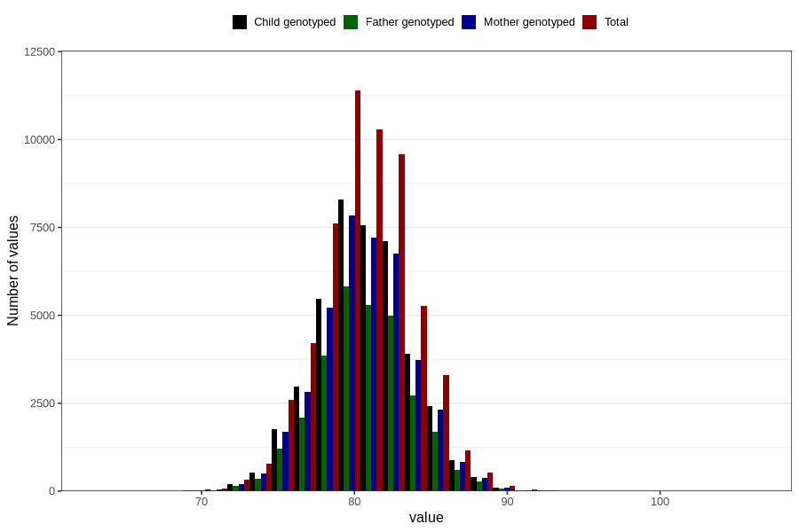

# length_16m
- Number of values:

| Value | Total | Child genotyped | Mother genotyped | Father genotyped |
| ----- | ----- | --------------- | ---------------- | ---------------- |
| Missing | 56245 | 33725 | 32135 | 21024 |
| Non-missing | 57378 | 41706 | 39634 | 29194 |
| 25th percentile | 78.5359641029743 | 78.699089475505 | 78.6825330416883 | 78.6987496685125 |
| 50th percentile | 80.5 | 80.6282967126067 | 80.6329274667455 | 80.6091696199221 |
| 75th percentile | 82.515309824534 | 82.6177759967942 | 82.6177759967942 | 82.5867413518246 |

