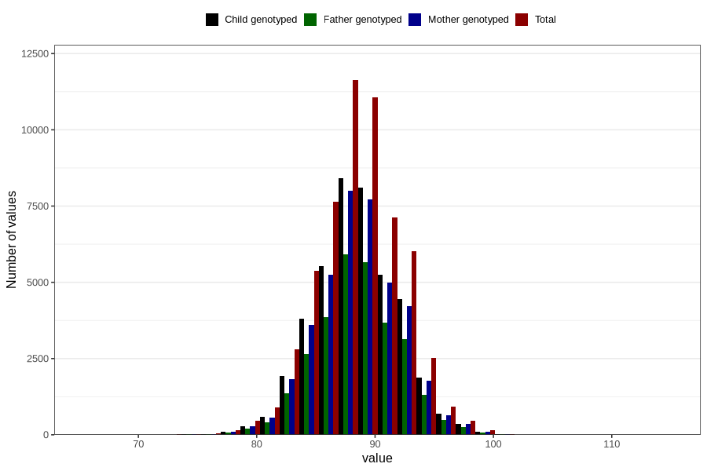

# length_2y
Variable mapping to questionnaire: q6, question GG20.
- Number of values:

| Value | Total | Child genotyped | Mother genotyped | Father genotyped |
| ----- | ----- | --------------- | ---------------- | ---------------- |
| Missing | 56269 | 33841 | 32248 | 21115 |
| Non-missing | 57354 | 41590 | 39521 | 29103 |
| 25th percentile | 86.0610433056114 | 86.273164176722 | 86.2641205078232 | 86.3343650672802 |
| 50th percentile | 88.5 | 88.5986568116712 | 88.5915647737391 | 88.6 |
| 75th percentile | 91 | 91 | 91 | 91 |

