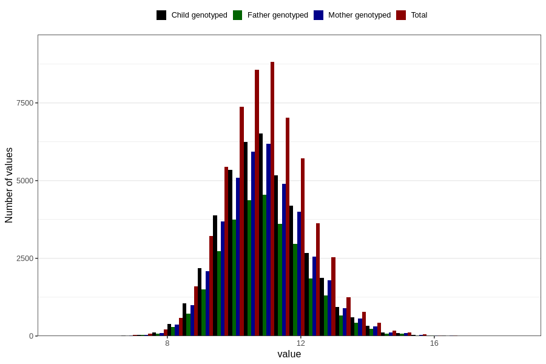

# weight_16m
- Number of values:

| Value | Total | Child genotyped | Mother genotyped | Father genotyped |
| ----- | ----- | --------------- | ---------------- | ---------------- |
| Missing | 55964 | 33582 | 32009 | 20950 |
| Non-missing | 57659 | 41849 | 39760 | 29268 |
| 25th percentile | 10.03 | 10.0751901172272 | 10.0736297162812 | 10.08 |
| 50th percentile | 10.83 | 10.8642770548319 | 10.8623792018326 | 10.86 |
| 75th percentile | 11.6807687522994 | 11.7 | 11.7 | 11.7 |

