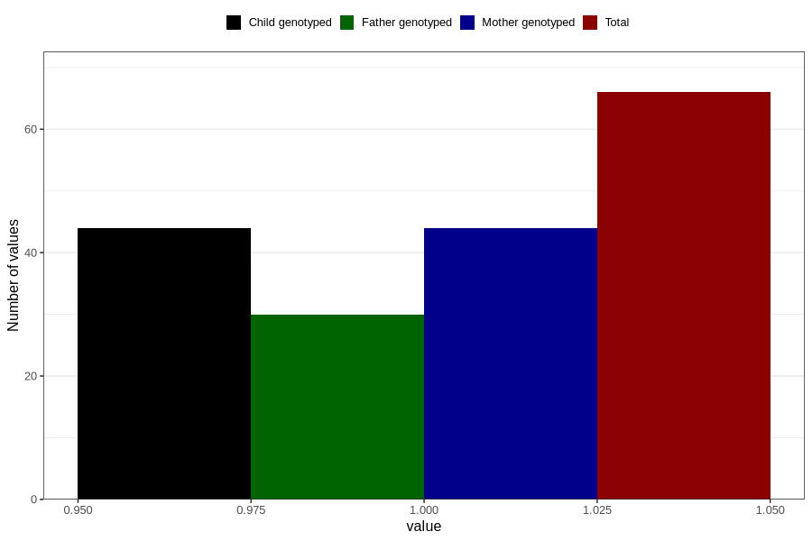

# aspergers_syndrome_7y
Variable mapping to questionnaire: q8, question JJ437.
- Number of values:

| Value | Total | Child genotyped | Mother genotyped | Father genotyped |
| ----- | ----- | --------------- | ---------------- | ---------------- |
| Missing | 113557 | 75387 | 71725 | 50188 |
| Non-missing | 66 | 44 | 44 | 30 |
| 1 | 66 | 44 | 44 | 30 |

