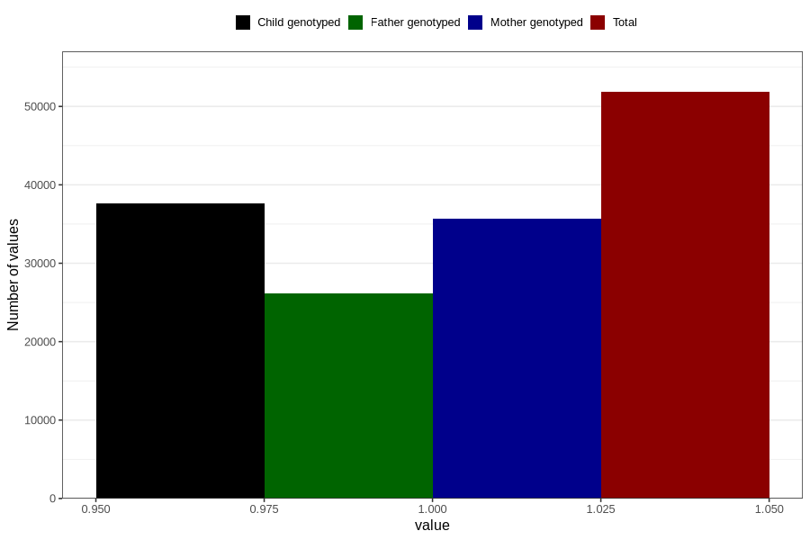

# asthma_no_3y
Variable mapping to questionnaire: q6, question GG69.
- Number of values:

| Value | Total | Child genotyped | Mother genotyped | Father genotyped |
| ----- | ----- | --------------- | ---------------- | ---------------- |
| Missing | 61790 | 37847 | 36067 | 24050 |
| Non-missing | 51833 | 37584 | 35702 | 26168 |
| 1 | 51833 | 37584 | 35702 | 26168 |

