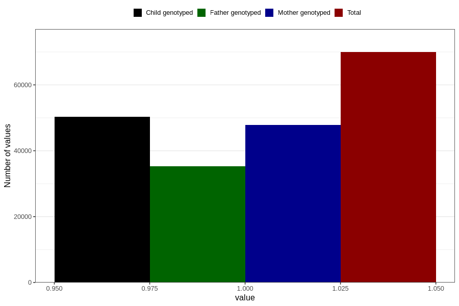

# behavioural_problems_no_18m
Variable mapping to questionnaire: q5, question EE847.
- Number of values:

| Value | Total | Child genotyped | Mother genotyped | Father genotyped |
| ----- | ----- | --------------- | ---------------- | ---------------- |
| Missing | 43688 | 25054 | 23907 | 14891 |
| Non-missing | 69935 | 50377 | 47862 | 35327 |
| 1 | 69935 | 50377 | 47862 | 35327 |

