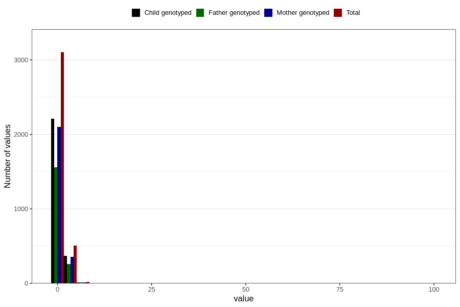

# ear_infection_freq_6m
Variable mapping to questionnaire: q4, question DD272.
- Number of values:

| Value | Total | Child genotyped | Mother genotyped | Father genotyped |
| ----- | ----- | --------------- | ---------------- | ---------------- |
| Missing | 109995 | 72829 | 69298 | 48392 |
| Non-missing | 3628 | 2602 | 2471 | 1826 |
| 0 | 126 | 89 | 83 | 68 |
| 1 | 2976 | 2124 | 2016 | 1488 |
| 2 | 379 | 279 | 268 | 191 |
| 3 | 90 | 67 | 64 | 49 |
| 4 | 25 | 17 | 14 | 9 |
| 5 | 11 | 9 | 9 | 9 |
| 6 | 6 | 5 | 5 | 5 |
| 7 | 11 | 8 | 8 | 5 |
| 10 | 1 | 1 | 1 | 1 |
| 12 | 1 | 1 | 1 | 0 |
| 15 | 1 | 1 | 1 | 0 |
| 99 | 1 | 1 | 1 | 1 |

