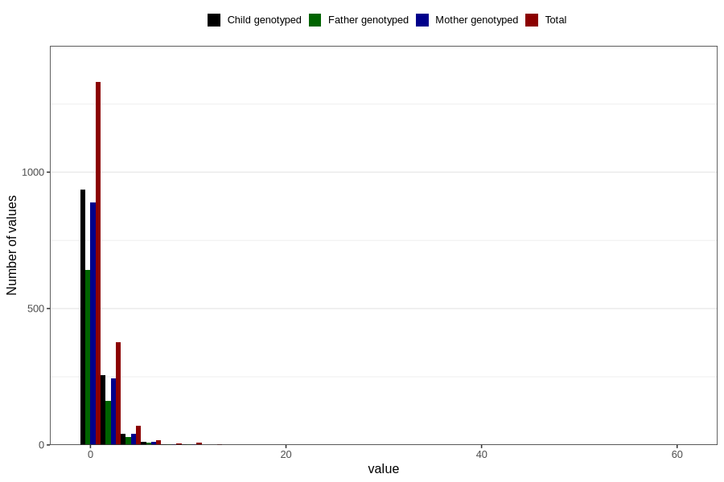

# febrile_convulsions_freq_3y
Variable mapping to questionnaire: q6, question GG159.
- Number of values:

| Value | Total | Child genotyped | Mother genotyped | Father genotyped |
| ----- | ----- | --------------- | ---------------- | ---------------- |
| Missing | 111807 | 74172 | 70574 | 49369 |
| Non-missing | 1816 | 1259 | 1195 | 849 |
| 0 | 52 | 40 | 40 | 29 |
| 1 | 1278 | 897 | 849 | 612 |
| 2 | 295 | 205 | 195 | 131 |
| 3 | 83 | 52 | 48 | 32 |
| 4 | 41 | 25 | 25 | 16 |
| 5 | 30 | 16 | 16 | 13 |
| 6 | 10 | 7 | 6 | 4 |
| 7 | 6 | 5 | 4 | 5 |
| 8 | 4 | 2 | 2 | 2 |
| 9 | 1 | 1 | 1 | 1 |
| 10 | 5 | 1 | 1 | 0 |
| 11 | 3 | 3 | 3 | 2 |
| 13 | 2 | 1 | 1 | 0 |
| 16 | 1 | 1 | 1 | 0 |
| 18 | 1 | 0 | 0 | 0 |
| 20 | 1 | 1 | 1 | 1 |
| 25 | 1 | 1 | 1 | 1 |
| 32 | 1 | 1 | 1 | 0 |
| 60 | 1 | 0 | 0 | 0 |

