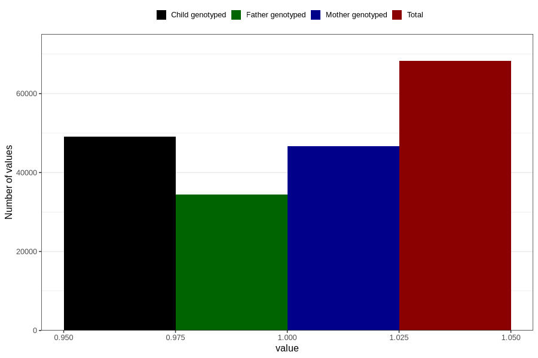

# hip_disorder_dislocated_hip_no_18m
Variable mapping to questionnaire: q5, question EE787.
- Number of values:

| Value | Total | Child genotyped | Mother genotyped | Father genotyped |
| ----- | ----- | --------------- | ---------------- | ---------------- |
| Missing | 45383 | 26317 | 25100 | 15762 |
| Non-missing | 68240 | 49114 | 46669 | 34456 |
| 1 | 68240 | 49114 | 46669 | 34456 |

