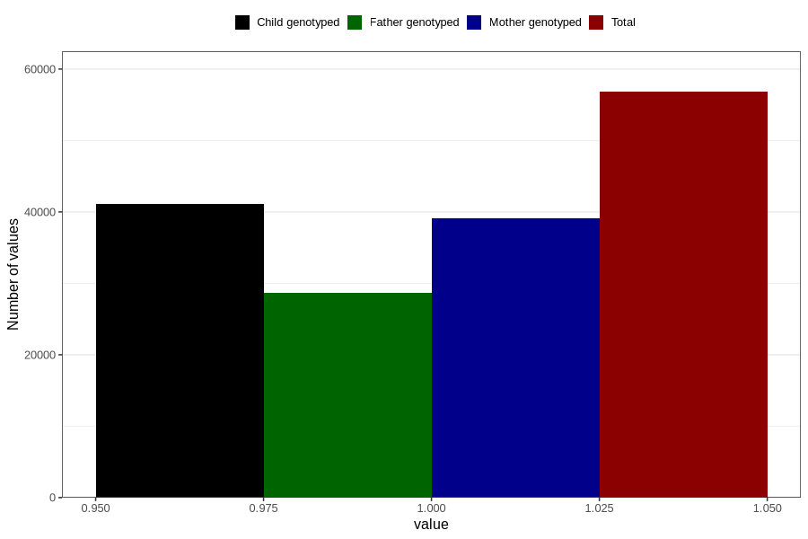

# joint_problems_no_3y
Variable mapping to questionnaire: q6, question GG45.
- Number of values:

| Value | Total | Child genotyped | Mother genotyped | Father genotyped |
| ----- | ----- | --------------- | ---------------- | ---------------- |
| Missing | 56814 | 34306 | 32689 | 21529 |
| Non-missing | 56809 | 41125 | 39080 | 28689 |
| 1 | 56809 | 41125 | 39080 | 28689 |

